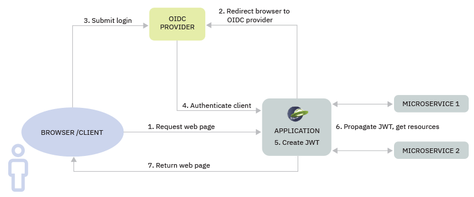

// Copyright (c) 2020 IBM Corporation and others.
// Licensed under Creative Commons Attribution-NoDerivatives
// 4.0 International (CC BY-ND 4.0)
//   https://creativecommons.org/licenses/by-nd/4.0/
//
// Contributors:
//     IBM Corporation
//
:page-description:
:seo-title: Authentication
:seo-description: Authentication is the processes by which an application that is running on Open Liberty confirms a user's identity.
:page-layout: general-reference
:page-type: general
= Authentication

In order for an application to be secure, it must be able to determine who its users are. Authentication is the process of confirming a user’s identity.

Open Liberty authenticates users by collecting credentials from them, such as a username and password, and checking these credentials against a configured registry of users. Authentication is completed in different ways, depending on the details of an application and the resources that are available to it. For microservice-based applications, authentication must be lightweight and configurable, since any user request might need to authenticate to multiple services. In many cases, a user's credentials are placed in a token that can be passed from the server to different microservices to authenticate requests for protected resources.

For example, a user of a streaming music service might want to listen to a song, learn about the artist, and get recommendations for similar artists. Each of these tasks requires access to a different service, but authenticating to each service separately expends time and resources. Open Liberty supports a number of different strategies for single sign-on (SSO) authentication so that a user or service authenticates only one time to access the various resources in an application. For example, the xref:reference:feature/socialLogin-1.0.adoc[Social Media Login] feature enables users of an application that is running on Open Liberty to authenticate through their social media login. After authentication, an application can either obtain a JSON Web Token (JWT) from the social media service or associated OpenID Connect provider, or create a new one. This JWT can then authenticate the user to any service in the application.

In the following diagram, a user requests access to protected resources in an application. During authentication, the user’s request is routed to an Open ID Connect identity provider, which confirms the user's identity and security roles. The identity provider sends authentication data back to the application, where it is used to authorize user access to protected resources. During xref:authorization.adoc[authorization], Open Liberty checks the roles that are specified for the user against the roles that are defined for the application resources. The user is granted access to any resources that match their role.

.Authentication diagram

== JAAS authentication

Open Liberty relies on the Java Authentication and Authorization Service (JAAS) framework, a Jakarta EE standard, to authenticate users.
JAAS specifies named login contexts, which are made up of different login modules, to authenticate a user.
Open Liberty contains a number of xref:reference:config/jaasLoginModule.adoc[built-in login contexts and login modules]. You can also configure modules and contexts to customize authentication details.
During authentication, the JAAS login modules authenticate the user's credentials and load user and group information.
Depending on the kind of credentials that are provided, the user and group information might be fetched from a user registry or an SSO token.

== User registries

A user registry is a data source that contains security information about a set of users. When a user requests a protected resource in an application, the user's credentials are checked against the information in one or more user registries. Open Liberty provides an easy-to-use basic user registry for developers to use in test environments. Typically, applications in production are configured to use an external registry, such as a Lightweight Directory Access Protocol (LDAP) registry.

Open Liberty supports multiple user registries and federates them into a single logical view. Information from LDAP, basic, and custom user registries can be federated into a common registry to manage application security.

If your application needs to reference a data store other than a basic or LDAP registry, you can configure a custom registry by implementing the `UserRegistry` interface. The `UserRegistry` interface is an API that enables support for virtually any type of account repository.

xref:reference:feature/appSecurity-3.0.adoc[The Application Security feature] provides core support for user registries in Open Liberty. For more information, see xref:user-registries-application-security.adoc[User registries for application security].

== Single sign-on

With xref:single-sign-on.adoc[single sign-on] (SSO), users can authenticate at one location and access multiple servers or services without being repeatedly prompted to log in. SSO is especially important for microservice-based applications, where a single user request might require authentication to several different microservices.

When a user authenticates to one Open Liberty server, an SSO token is created for that user and is put in a cookie. The cookie is then sent to the HTTP client, for example, a browser. If the same user makes a request to access another application that is on a different server, but in the same SSO configuration, the cookie is sent along with the request. If the receiving server can validate the token, the user is authenticated without being prompted for another login. If the server cannot validate the token, for example, because of an LTPA key mismatch, the user is prompted to enter the credential information again.

Open Liberty supports the following options for SSO authentication:

=== Social Media Login
Users can authenticate to websites that are hosted on Open Liberty by logging in with their social media accounts. When the xref:reference:feature/socialLogin-1.0.adoc[Social Media Login] feature is enabled, login is automatically configured for Facebook (TM), Twitter (TM), Google (TM), Linkedin (TM), and GitHub (TM) credentials. You can also define your own configuration for any social media platform that is based on the OAuth 2.0 or OpenID Connect 1.0 standards.

=== JSON Web Tokens (JWT)
A https://jwt.io/[JWT] is a JSON object that can securely transmit information between parties in a compact and self-contained way. The information that is contained in the token can be verified and trusted because it is digitally signed, either by using an algorithmic secret or a public and private key pair. After a user identity is established by an SSO provider, a JWT can propagate that identity between different microservices and applications. For more information, see the guide to link:/guides/microprofile-jwt.html[Securing microservices with JSON Web Tokens].

=== Lightweight Third Party Authentication (LTPA)
LTPA provides a token-based SSO configuration to authenticate users when they are accessing web applications and services. With LTPA enabled, you can encrypt, digitally sign, and securely transmit authentication-related data among applications and services. By default, when a client is authenticated with Open Liberty, an LTPA cookie is created and sent to the HTTP servlet. An LTPA cookie contains an encrypted authentication token with user identity and expiration information. When the client accesses another protected resource with the same LTPA configuration, authentication with the LTPA cookie happens before any other authentication mechanism. In Open Liberty, xref:reference:config/ltpa.adoc[LTPA is configured by default] when xref:reference:feature/appSecurity-3.0.adoc[the Application Security feature] is enabled. If you want to use another mechanism for authentication, you can disable LTPA cookies in the configuration for your chosen mechanism.

=== OpenID Connect (OIDC)
OIDC is a simple identity protocol based on OAuth 2.0 that is widely used in SSO technologies. This protocol enables a client application to request the identity of the user as an ID token in a standardized, REST-like manner. The client application, or Relying Party, requests information about a user from an authorization server, which is known as an OIDC Provider. After users are authenticated by an OIDC Provider, they can access any Relying Party that is configured for that provider, without having to manage unique accounts for each application or website. xref:reference:feature/openidConnectServer-1.0.adoc[Open Liberty can act as an OIDC provider], which can be useful in development and testing environments. Although Open Liberty can also act as an OIDC provider in production, typically applications in deployment use a cloud-hosted SSO provider.

=== Security Assertion Markup Language (SAML)
When SAML SSO is configured, web applications can delegate user authentication to a SAML identity provider instead of a configured user registry. With SAML  SSO, enterprises can manage and control user identities from a centralized location. You can configure SAML authentication for Open Liberty with xref:reference:feature/samlWeb-2.0.adoc[the SAML web single sign-on feature].

=== Simple and Protected GSS-API Negotiation Mechanism (SPNEGO)
When SPNEGO SSO is enabled, users can log in to the Microsoft (TM) domain controller one time to access and move between protected resources on Open Liberty servers.
For more information, see xref:configuring-spnego-auth.adoc[Configuring SPNEGO authentication in Open Liberty].

== See also

Ready to try out authentication with Open Liberty for yourself? Check out the following guides to securing applications:

- Learn how to secure a web application through authentication and authorization in the guide to link:/guides/security-intro.html[Securing a web application].
- Explore how to control user and role access to microservices with JSON Web Tokens in the guide to link:/guides/microprofile-jwt.html[Securing microservices with JSON Web Tokens].
